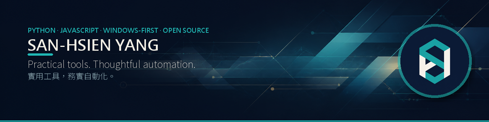

  

# SanHsien

I build practical, Windows-first tools and AI-assisted workflows with an emphasis on **local-first design, clear boundaries, and verifiable releases**.  
我專注製作實用、Windows 優先的工具與 AI 協作流程，重視 **本機優先、清楚邊界、可驗證交付**。

Most projects start from a real workflow problem: reduce repetitive work, make advanced tooling easier to use, and ship something people can actually run.  
多數專案都從實際工作流程中的痛點出發：減少重複操作、降低工具使用門檻，並把想法做成真正能執行的產品。

## Featured Projects / 精選作品

### [OpenShelf](https://github.com/SanHsien/openshelf)

Batch-export books you legally own in Google Play Books: DRM-free EPUB/PDF files are downloaded directly, DRM-protected titles keep their official `.acsm` handoff for Adobe Digital Editions. HTTP-first, resumable, and local-first.

批次匯出自己合法擁有的 Google Play 圖書：無 DRM 書籍下載 EPUB/PDF，受 DRM 保護的書籍則保留官方 `.acsm` 交接流程。採 HTTP-first、可續傳、本機優先設計。

`Python` `Playwright` `httpx` `Desktop GUI` `Local-first`

### [聲成文 VoxProse](https://github.com/SanHsien/voxprose)

Local-first AI voice typing for Windows: global-hotkey recording, on-device Faster-Whisper transcription, optional LLM rewriting and translation, then direct typing into the focused app.

Windows 本機優先 AI 語音輸入工具：全域快捷鍵錄音、本機 Faster-Whisper 辨識、可選 LLM 潤飾與翻譯，最後直接輸入目前作用中的程式。

Derived from VoiceType4TW and independently maintained for Windows.

`Python` `PyQt6` `Faster-Whisper` `CUDA` `Windows`

### [ChannelDepot](https://github.com/SanHsien/channeldepot)

Portable YouTube channel archiving with GUI, CLI, release builds, batch workflows, filters, ffmpeg integration, and support for content the signed-in user is already authorized to watch.

可攜式 YouTube 頻道影片保存工具，提供 GUI、CLI、批次工作流、篩選、ffmpeg 整合與 Windows 發行版，也支援處理登入者原本就有權觀看的內容。

`Python` `yt-dlp` `Tkinter` `ffmpeg` `Windows / macOS / Linux`

### [VoxAvatar](https://github.com/SanHsien/voxavatar)

Windows-only VRM desktop companion that turns an AI assistant's playback into visible lip sync, motions, states, and message bubbles. Compatible agents can control it through a loopback-only MCP server.

Windows 專用 VRM 桌面角色：把 AI 助理的播放聲音轉成口型、動作、角色狀態與訊息氣泡，並可由相容 Agent 透過僅限本機的 MCP 控制。

Derived from `xikhar/persona` and independently maintained as VoxAvatar.

`TypeScript` `Electron` `Three.js` `VRM / VRMA` `MCP`

## Agent Skills & Tooling / Agent 技能與開發套件

Developer-facing work for AI coding agents, listed separately from the desktop apps above. This section mixes original engineering references with independently maintained Windows-first forks; these are tooling for agent workflows, not general-user downloadable apps.

給 AI coding agent 用的開發向作品，與上方桌面產品分開列出。這一區包含原創工程參考專案與 Windows-first 維護型 fork，服務的是 agent 工作流，不是一般使用者下載即用的 App。

### AI Coding Governance Stack / AI Coding 治理堆疊

Four repositories that constrain AI coding agents at four different layers. Each is usable on its own; together they cover the decision to delegate, the actions taken, the code produced, and the claim that it is done.

四個 repo 分別在四個層面約束 AI coding agent：要不要派工、動手時做了什麼、產出的程式碼夠不夠格、以及「做完了」這句話算不算數。每一個都能單獨使用。

| Layer / 層 | Repo | |
| --- | --- | --- |
| Dispatch / 派工決策 | [agent-advisor](https://github.com/SanHsien/agent-advisor) | Risk-gated routing across four agent runtimes ｜四種 agent runtime 的風險分流路由 |
| Execution / 動作攔截 | [harness-guard](https://github.com/SanHsien/harness-guard) | Runtime hooks that block dangerous commands, unevidenced completion claims, and commits over failing tests ｜實際攔截危險指令、無證據的完成宣稱、紅燈仍提交 |
| Output / 產出品質 | [ai-quality-gates](https://github.com/SanHsien/ai-quality-gates) | Executable specs and quantified thresholds (detailed below) ｜可執行規格與量化門檻（詳見下方） |
| Delivery / 交付流程 | [paulsha-cortex](https://github.com/SanHsien/paulsha-cortex) | Candidate, verification, independent review, and completion evidence ｜候選、驗證、獨立審查與完成證據 |

`Agent hooks` `Multi-agent governance` `Windows-first` `Python`

### [AI Quality Gates](https://github.com/SanHsien/ai-quality-gates)

Executable reference project for AI-assisted development quality: Gherkin specs, layered tests, coverage and mutation gates, architecture contracts, strict typing, security checks, and bounded agent-loop policies.

把 AI 輔助開發的品質要求做成可執行證據：Gherkin 規格、分層測試、覆蓋率與 mutation gate、架構契約、strict typing、安全檢查，以及有界的 Agent loop policy。

`Python` `pytest` `Gherkin` `Mutation testing` `CodeQL` `Agent governance`

### [agentdeck](https://github.com/SanHsien/agentdeck)

Windows system-tray cockpit for Claude Code, Codex, and Antigravity: local quota monitoring, multi-model roundtable, subagent roles, and HTML reports. Claude and Codex quota data are read from local files only.

Windows 系統匣控制台：本機額度監看、多模型圓桌討論、subagent 角色部署與 HTML 報告。Claude／Codex 額度只讀本機檔案，不呼叫用量 API。

Derived from `aqua5230/usage` and independently maintained for Windows.

`Python` `Windows` `System tray` `Local-first` `Independent fork`

### [opencodex](https://github.com/SanHsien/opencodex)

Universal provider proxy for OpenAI Codex and Claude Code: run either client against any LLM—Claude, Gemini, Grok, DeepSeek, or a local Ollama model—through one local proxy and dashboard, with the native model picker still doing the choosing.

讓 OpenAI Codex 與 Claude Code 能改用任何 LLM 的通用供應商代理：Claude、Gemini、Grok、DeepSeek 或本機 Ollama 都經由同一個本機代理與儀表板轉發，選擇器仍是原生的，換掉的只有後面實際跑的模型。

Sits next to the governance stack above rather than inside it: it decides which model an agent runs on, not what the agent is allowed to do.

它與上方的治理堆疊相鄰但不同層：決定 agent 背後跑哪個模型，不約束 agent 能做什麼。

Windows-first maintenance fork of [`lidge-jun/opencodex`](https://github.com/lidge-jun/opencodex).

`TypeScript` `Node.js` `LLM routing` `Local proxy` `Independent fork`

### [book-to-skill](https://github.com/SanHsien/book-to-skill)

Turn a technical book, a docs folder, or a set of sources into on-demand Agent Skills for GitHub Copilot CLI, Amp, and Claude Code—load the relevant chapter instead of stuffing the whole book into context.

把技術書、文件資料夾或一組來源轉成可按需載入的 Agent 技能，給 Copilot CLI、Amp 與 Claude Code 在工作中直接查、直接用；問到某一章時只載入該章，不必把整本書塞進上下文。

Windows-first maintenance fork of [`virgiliojr94/book-to-skill`](https://github.com/virgiliojr94/book-to-skill).

`Python` `Agent Skills` `Windows-first` `Independent fork`

[Browse all public repositories →](https://github.com/SanHsien?tab=repositories&q=&type=public&language=&sort=)

## What I Build / 我在做什麼

- **Local-first desktop tools** — Windows EXE, CLI, desktop GUI, portable workflows.  
  **本機優先桌面工具** — Windows EXE、CLI、桌面 GUI、可攜式流程。
- **Accessible AI workflows** — bring AI into familiar interfaces instead of forcing users into new ones.  
  **降低 AI 使用門檻** — 把 AI 放進熟悉的介面，而不是要求使用者重學一套工具。
- **Automation for repetitive work** — media, documents, downloads, data handling, and operational workflows.  
  **重複工作自動化** — 媒體、文件、下載、資料處理與日常作業流程。
- **AI-assisted development with verification** — agents help build faster, but releases still need tests, packaging, and explicit limits.  
  **有驗證的 AI 協作開發** — AI Agent 協助加速原型、重構與文件，但交付仍需測試、打包與清楚限制。

## Earlier & Private Work / 過往與非公開作品

Earlier work includes Excel/VBA business automation, Palm and Android field applications, web-based submission/review systems, and internal operational tools. Private or organizational projects are described by capability only; identifying details and production data are intentionally omitted.

過往作品包含 Excel/VBA 營運自動化、Palm 與 Android 行動程式、線上填報／審查系統，以及組織內部作業工具。私人或組織型專案僅描述能力與成果，不公開可識別資訊與正式資料。

## Working Principles / 工作原則

- **Local-first by default** — if it can run on the user's machine, avoid adding a hosted backend first.  
  **預設本機優先** — 能在使用者本機完成的功能，就不優先增加託管式後端。
- **Release-oriented** — downloadable, runnable, and verifiable beats a one-off demo.  
  **以交付為導向** — 可下載、可執行、可驗證，比一次性的 demo 更重要。
- **Privacy-aware** — user files, images, and tokens should not be sent to unnecessary services.  
  **重視隱私邊界** — 使用者的檔案、圖片與 token 不應送往不必要的服務。
- **Clear boundaries** — licensing, platform rules, unsupported scenarios, and operational risks should be explicit.  
  **清楚寫明邊界** — 授權、平台規則、不支援情境與操作風險都應明確說明。

## Tools / 工具

## Elsewhere / 其他平台

- [LinkedIn](https://www.linkedin.com/in/sanhsien/) — professional profile / 專業檔案
- [Facebook](https://www.facebook.com/sanhsien) · [Instagram](https://www.instagram.com/sanhsien/) · [Threads](https://www.threads.com/@sanhsien) · [X](https://x.com/Hsien_3)
